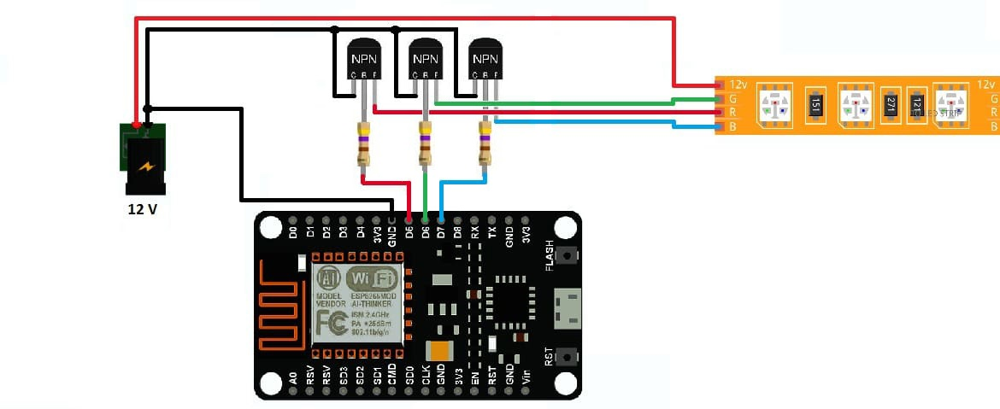

# Светодиодная RGB-лента на микроконтролере Arduino WiFi ESP8266 NodeMCU
# + Исходный код пульта под Windows/Android
 <p align="center"> 
 <br>  --------------  Diagrama  ---------------  </br> </p>


## как настройка arduino IDE для Arduino esp8266 http://geekmatic.in.ua/arduino_ide_with_wifi_esp8266

sketch code for Arduino WiFi ESP8266 NodeMCU 
```cpp
#include <ESP8266WiFi.h>           // Библиотека WiFi связь 
#include <WiFiUdp.h>               // Udp-Сокет 
#include <string>
#include <iostream>
#include <sstream>

using std::string;
using std::stringstream;
using std::cout;
using std::endl;


//-----------------//

int PWM_LED_A = 14; //pin D5 - Red
int PWM_LED_B = 12; //pin D6 - Green
int PWM_LED_C = 13; //pin D7 - Blue

//----------------//
unsigned int localPort = 8888; // Локальный порт прослушевания сети 

const char *ssid     = "LED"; // SSID имя WiFi точки-доступа 
const char* password = "12345678"; // Пароль WiFii  


IPAddress local_ip(192,168,1,100);  // IP-адрес нашой платы статичский 
IPAddress gateway(192,168,1,1);  // IP-адрес шлюза  
IPAddress subnet(255,255,255,0); // Подсеть 

#define PACKET_MAX_SIZE 255         // Масимальный размер пакета-данных 
char packetBuffer[PACKET_MAX_SIZE]; // Буферы для приема и отправки пакета-данных,

WiFiUDP UDP; // UPD-сокет обект 

// Структора данных , кнтроля робокара 
struct Color3                                                                                
{   
    int R,G,B;
};


Color3 _gColor;


void setup() 
{
    //----------------------------//
    // Инцилизмруем все пины как OUTPUT
    //----------------------------//
    pinMode(PWM_LED_A , OUTPUT );
    pinMode(PWM_LED_B , OUTPUT );
    pinMode(PWM_LED_C , OUTPUT );
  
    //-------------------------//

    _gColor.R = 0;
    _gColor.G = 0;
    _gColor.B = 0;
  
    //-------------------------//
    
    // Запускаем сериал порт на скрости 115200.импульсов\сек 
    Serial.begin(115200);                         
  
    // присваиваем статичесий IP адрес
    WiFi.mode(WIFI_STA); // режим клиента
    WiFi.config(local_ip, gateway, subnet);
    WiFi.begin(ssid, password);
  
   // Ждем потключение к WiFi 
    Serial.println("Connecting to Wifi");
    int count_n = 0;
    while (WiFi.status() != WL_CONNECTED) 
    {   
      delay(500);
      Serial.print(".");
      delay(500);
      if(count_n++ > 10) break;
    }

    // Если не потключились к WiFi , 
    // то создаем точку доступу WiFi в самом устройстве с
    // исходными SSID | Password
    if(WiFi.status() != WL_CONNECTED)
    {
      boolean result =
      WiFi.softAP(ssid, password);                  // Устанавливаем режым точки доступа WiFi
      WiFi.softAPConfig(local_ip, gateway, subnet); // Устанавливаем статические IP-адреса 
      delay(100);                                   // Ждем 100 милисекунд 
  
      // вывод данных о сети 
      IPAddress myIP = WiFi.softAPIP();             // IP-адрес робокара
      Serial.print("AP IP address: ");             
      Serial.println(myIP);
      if(result == true) Serial.println("Ready"); else Serial.println("Failed!");
    }
 
    // выввод информации о сервере    
    Serial.print("Connected! IP address: ");
    Serial.println(WiFi.localIP());
    Serial.printf("UDP server on port %d\n", localPort);
    
    // Начинаем слушать порт 
    UDP.begin(localPort);                      
}


void loop()
{

    // Ждем ..! И если есть данные, начинаем обрабатывать пакет-данных
    int packetSize = UDP.parsePacket();
    if (packetSize) 
    {
        // Читаем пакеты в packageBufffer
        int n = UDP.read( packetBuffer , sizeof(Color3));          
        packetBuffer[n]=0;

        // Переобразуем данные в удобный нам формат 
         Color3 *data_control = (Color3*)&packetBuffer;  
        _gColor = *data_control;
                                  

        char buff[256];
        sprintf( buff , "-- R:%d , G:%d , B:%d -- \n" , 
                 data_control->R ,
                 data_control->G , 
                 data_control->B );

                 
        // Выввод присланых данных в сериал порт 
        Serial.printf( buff );

        /// Отсилаем данные обратно 
        UDP.beginPacket(UDP.remoteIP(), UDP.remotePort());
        UDP.write(buff);
        UDP.endPacket();
    }

    analogWrite(PWM_LED_A, _gColor.R); // ШИМ красного цвета 
    analogWrite(PWM_LED_B, _gColor.G); // ШИМ зелёного цвета 
    analogWrite(PWM_LED_C, _gColor.B); // ШИМ синего цвета 
    
    delay(10); // Ждем 10 милисекунд 
}
```
